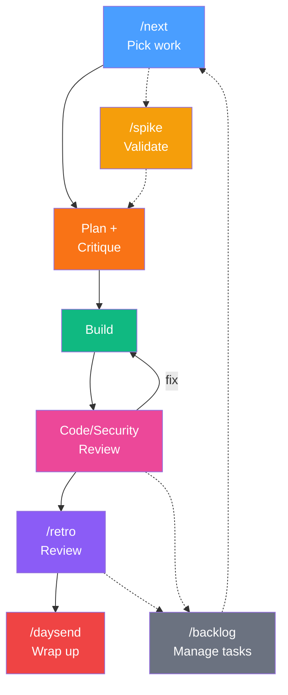

# skills

My personal [Claude Code](https://docs.anthropic.com/en/docs/claude-code) slash commands that I use frequently for managing work sessions — planning what's next, running retrospectives, and wrapping up the day.

These commands are project-agnostic. Install them in any repo and they work with that project's structure.

## Workflow



**The daily loop:** `/next` picks work from the backlog → `/spike` validates unknowns → plan with [devils-advocate](https://github.com/brandonsimpson/devils-advocate) critique → build → code/security review → `/retro` captures learnings → `/daysend` wraps up (retro, memories, CLAUDE.md reflection, commit). Reviews and retros feed new items back into the backlog.

## What's Included

### `/next` — What's Next

Reviews your project backlog and presents prioritized next steps for the session.

- Reads `BACKLOG.md` and parses all sections
- Runs a quick project health check (tests, uncommitted work, recent commits)
- Presents blocking items, a recommended next action, and quick wins
- Waits for your decision before doing anything

### `/retro` — Task Retrospective

A structured review of your work session. Captures what was built, what went wrong, what was learned, and feeds those learnings back into your project docs.

- Asks for your acceptance rating
- Writes a retro file to `docs/retros/`
- Maintains a running retro log for trend analysis
- Identifies source docs that need updating based on what was learned
- Evaluates planning and review process quality (not just work output)
- Captures process improvements — workflow breakdowns, missing rules, skill updates needed

### `/backlog` — Backlog Manager

Manage your project's todo backlog from the command line.

- Shows, adds, completes, removes, and prioritizes items in `BACKLOG.md` at the project root
- Auto-numbers items and renumbers after changes
- Tracks completion dates in a Done section
- Creates `BACKLOG.md` with standard format if it doesn't exist

### `/spike` — Technical Spike

Run a rapid validation spike on a technology, framework, API, or architectural approach before committing to it.

- Asks for your riskiest assumption to focus the spike
- Creates a standalone spike directory with runnable scripts
- Tests real APIs and behavior (no mocking)
- Documents findings with status, gotchas, and architecture impact
- Commits results and updates backlog

### `/daysend` — Day's End

A single command that runs the full end-of-day routine: retro, memory persistence, and commit. Designed to wrap up your session in one shot.

- Runs `/retro`
- Persists any new learnings to Claude's memory system
- Commits all session work
- Checks for unpushed commits and asks before pushing

## Install

Clone this repo and copy the commands into your project's `.claude/commands/` directory:

```bash
# Copy all commands
cp -r skills/.claude/commands/ your-project/.claude/commands/

# Or symlink for automatic updates
ln -s /path/to/skills/.claude/commands/next.md your-project/.claude/commands/next.md
ln -s /path/to/skills/.claude/commands/retro.md your-project/.claude/commands/retro.md
ln -s /path/to/skills/.claude/commands/backlog.md your-project/.claude/commands/backlog.md
ln -s /path/to/skills/.claude/commands/spike.md your-project/.claude/commands/spike.md
ln -s /path/to/skills/.claude/commands/daysend.md your-project/.claude/commands/daysend.md
```

Or install globally so they're available in every project:

```bash
cp skills/.claude/commands/*.md ~/.claude/commands/
```

## Customization

These commands are meant to be forked and adapted. A few things you might want to change:

- **Output paths** — retros write to `docs/retros/`. Change these to match your project structure.
- **Commit message format** — each command uses a conventional prefix (`retro:`, `daysend:`). Adjust to match your project's conventions.

## Author

[Brandon Simpson](https://brandon.cc) · [@surfnscale](https://x.com/surfnscale)

## License

MIT
